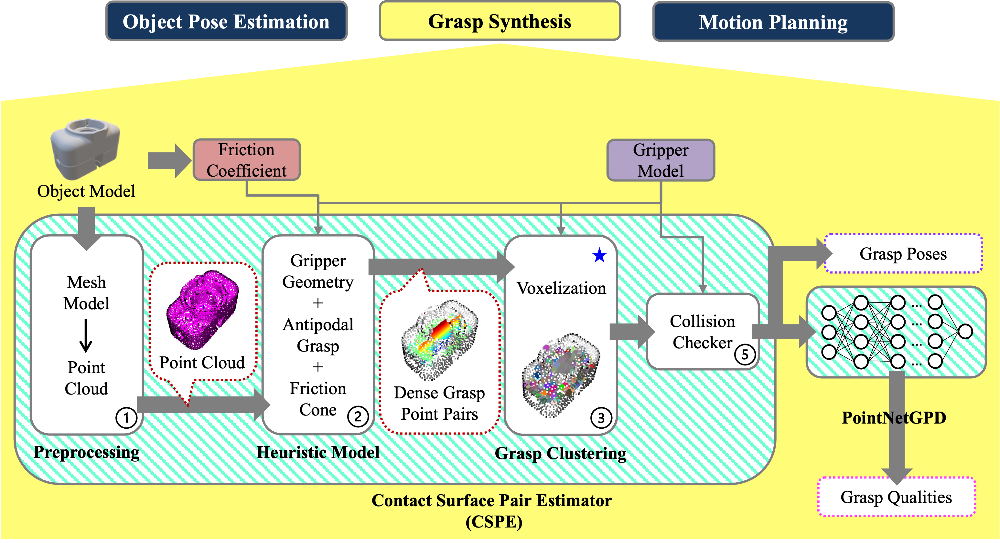

# PointNetCSPE
Combination of Contact Surface Pair Estimator (CSPE) and [PointNetGPD](https://github.com/lianghongzhuo/PointNetGPD) for offline 6DOF grasp detection. The framework takes a complete object point cloud file to generate possible contact surface pairs and their robustness (a.k.a grasp dictionaries) for a parallel jaw gripper using both analytical and data-driven models.

The project was done while [Hojun Lee](https://www.linkedin.com/in/hjunlee94/) was working for Barton Research Group ([BRG](https://brg.engin.umich.edu/)) at the University of Michigan.

## Table of Contents

- [Repository Structure](#repository-structure)
- [Download Process](#download-process)
- [How to Run](#how-to-run)
    - [CSPE_v2](#cspe_v2)
    - [Extra Processing](#extra-processing)
    - [Quality Estimation (ML)](#quality-estimation)
- [ToDo Lists](#todo-lists)

---

## Repository Structure

    ├── ML_modules        # DL modules 
    │   ├── engine.py
    │   ├── eval.py
    │   ├── train.py
    │   ├── transforms.py 
    │   ├── utils.py 
    │   ├── model
    │   │   └── pointnet.py
    │   ├── weights
    │   │   └── pointnetgpd_3class.model
    ├── dataset
    |   ├── train         # ML training data
    |   └── test          # ML test data
    ├── images
    ├── objects
    │   ├── dicts         # .txt grasp files
    │   └── pcds          # .pcd files
    ├── CSPE_utils.py
    ├── CSPE_v2.py
    ├── gripper_config.py 
    └── helper.py 

## Download Process

    git clone https://github.com/kidpaul94/PointNetCSPE.git
    cd PointNetCSPE/
    pip3 install -r requirements.txt
    pip3 install 'git+https://github.com/katsura-jp/pytorch-cosine-annealing-with-warmup'

## How to Run

### CSPE_v2:

> **Note**
`CSPE_v2.py` receives several different arguments. Run the `--help` command to see everything it receives.

    python3 CSPE_v2.py --help

### Extra Processing:

> **Note**
`helper.py` receives several different arguments to convert a CAD model to a point cloud or visualize grasp configurations. Run the `--help` command to see everything it receives.

    python3 helper.py --help

### Quality Estimation:

> **Note**
`train.py` receives several different arguments. Run the `--help` command to see everything it receives.
    
    cd ML_modules/
    python3 train.py --help

> **Note**
`eval.py` receives several different arguments. Run the `--help` command to see everything it receives.
    
    cd ML_modules/
    python3 eval.py --help

## Citation

    @inproceedings{liang2019pointnetgpd,
    title={{PointNetGPD}: Detecting Grasp Configurations from Point Sets},
    author={Liang, Hongzhuo and Ma, Xiaojian and Li, Shuang and G{\"o}rner, Michael and Tang, Song and Fang, Bin and Sun, Fuchun and Zhang, Jianwei},
    booktitle={IEEE International Conference on Robotics and Automation (ICRA)},
    year={2019}
    }

## ToDo Lists

| **ML pipeline** |  |
| --- | --- |
| **Documentation** |  |
